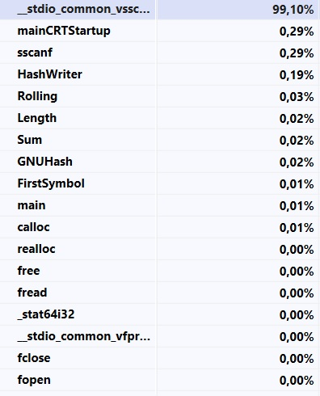
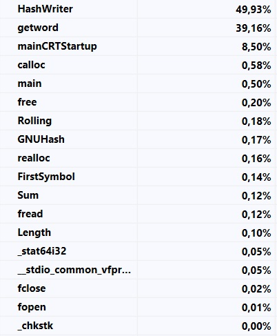

# Optimize_Hash_Table
Using asm to speed up hash table 

Hash Table - gets hashes of 290550 english words
Let's see how fast it is

# time = 111 seconds 
that is definitely slow. 
However it is clear where is the bottleneck - it's sscanf!
Of course we don't need all sscanf functionality so lets write mini-sscanf on asm that gets word from text.

let's check how fast is hash table now.

# time = 2.16 seconds
Wow! That's much better. And other functions that can be rewritten don't have much impact on time.
For example, let's rewrite Rolling and check again.

# time = 2.05 seconds
No diffrences it's just a permissible error. 
So in conclusion we have accelerated hash table more than 50 times! Learn asm - it's useful!

